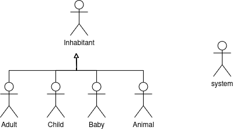
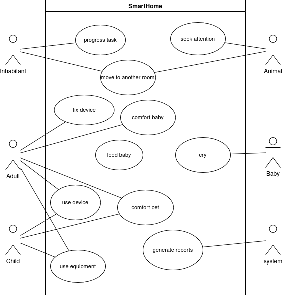
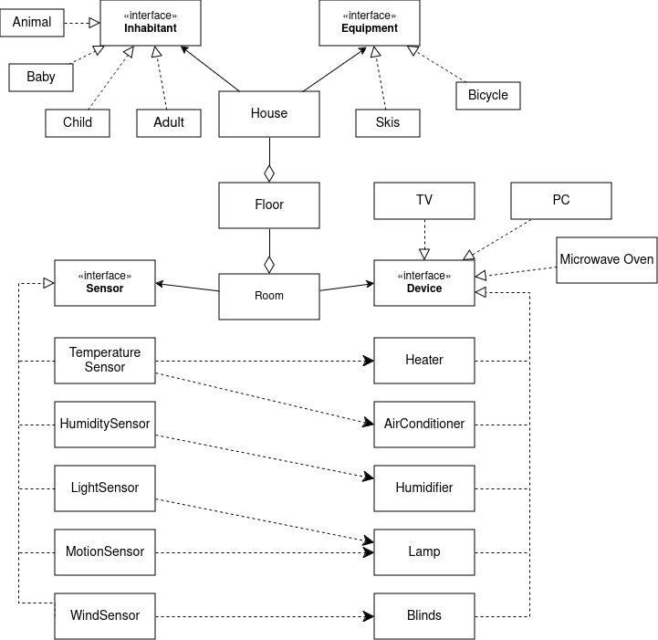

# OMO SmartHome
Semestrální projekt FEL ČVUT

## Popis Aplikace

Tato aplikace slouží k simulaci „chytré domácnosti“ (SmartHome). V rámci simulace můžeme spravovat dům, rozdělený na více pater a místností, v nichž se nacházejí nejrůznější zařízení a senzory.
Aplikace eviduje obyvatele (lidé různého věku, zvířata, miminko) a jejich interakce se zařízením či s událostmi. 
Události se v každém kroku (ticku) simulace vyhodnocují a zpracovávají, aby bylo možné určit nové stavy a spotřebu energie.

## Analýza

### Diagram aktérů

### Diagram případů užití

### Diagram entit

### Funkční požadavky

- **FR01:** Každá místnost bude uchovávat aktuální stav (teplota, pohyb, vlhkost, světelné podmínky apod.), který je poskytován senzory.

- **FR02:** Místnost bude notifikovat registrovaná zařízení o každé změně stavu.

- **FR03:** Senzory budou monitorovat stav a aktualizovat stav místností.

- **FR04:** Zařízení budou reagovat na změny stavu místností podle předem definovaných pravidel.

- **FR05:** Zařízení budou fungovat automaticky pouze v místnostech, kde je k dispozici příslušný senzor.

- **FR06:** Obyvatelé budou moci spouštět události a na tyto události budou reagovat konkrétní osoby.

- **FR07:** V každém ticku bude probíhat zpracování událostí, přičemž nevyřešené události budou zůstávat ve frontě do dalšího kroku.

- **FR08:** Obyvatelé budou dostávat úkoly, jejichž splnění zabere několik tiků. Po celou dobu trvání úkolu je daný obyvatel vytížen, a nemůže tedy reagovat na další události.

- **FR09:** Systém bude generovat reporty o aktivitě obyvatel, činnosti senzorů, událostech a o spotřebě elektřiny zařízení.

- **FR10:** Veškerá konfigurace se bude načítat z externího JSON souboru.

## Implementace

### Použité design patterny

| Patterny | Popis | Package - kde najít |
| ------ | ------ | ------ |
| State       | Řízení stavů zařízení (např. zapnuto/vypnuto, porucha)       | entities/devices/state|
| Iterator       | Iterace přes hierarchii budovy pro získání dat a generování reportů      | iterators|
| Composite | Iterace přes hierarchii budovy pro získání dat a generování reportů | reports/HouseComponent, entities/House, Floor, Room|
|Visitor|Iterace přes hierarchii budovy pro získání dat a generování reportů | reports/Visitor, ConsumptionReport|
|Factory|Vytváření entit (místností, zařízení, obyvatel) na základě konfigurace z JSON| entities/devices, entities/equipment, entities/inhabitants, entities/sensors|
|Builder|Vytváření entit (místností, zařízení, obyvatel) na základě konfigurace z JSON|entities/builders|
|Observer| Zařízení sledují stav místnosti a reagují na jeho změny | entities/devices|
|Singleton| Jediná instance pro klíčové služební komponenty systému| Simulation, events/EventBus|
|Event Bus|Všechny události jsou spravovány a distribuovány přes Event Bus k registrovaným posluchačům|events/EventBus|
|Command|Každé zadání je zpracováno jako příkaz s konkrétními daty| task|
|Chain of Responsibility|Vytváří řetězec obyvatel, kteří postupně zkoumají událost a mohou na ni reagovat, pokud jsou toho schopni.|config/ChainBuilder|

### Použití funkcionálního programování a Stream API

- **RoomBuilder** `build()`
- **Simulation** `getUsableObjects()`, `getDevices()`, `getRooms()`

### Postup spuštění aplikace

1. Naklonujte si tento repozitář do svého prostředí.
2. Ve třídě `Start` vyberte jeden ze dvou připravených konfiguračních souborů `houseconfig.json` nebo použijte vlastní. 
Tyto soubory se nacházejí ve složce `resources`.
3. Ve třídě `Simulation` nastavte požadovaný počet ticků (časových kroků) simulace.
4. Spusťte metodu `main` ve třídě `Start`.
5. Po ukončení simulace se vygenerují reporty a příslušné textové soubory budou umístěny v adresáři `sh/reports`. 
